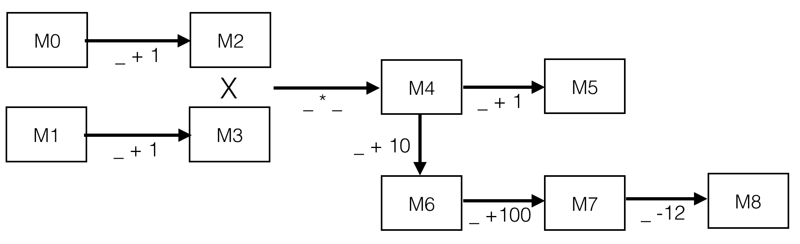

# Combinator Library for Incremental Processing Pipelines

## Quick start

Check out the example in SimpleExample.scala . 

```
{ ((m0 :--PlusOne--> m2) <-*BatchProduct.composer[IDInt,IDInt]*-> (m1 :--PlusOne--> m3)) :--TimesPair--> m4 } :< {
       (PlusOne--> m5) ~ (Plus(10)--> m6 :--Plus(100)--> m7 :--Plus(-12)--> m8)
}
```

encodes the following:



Here's how the language is defined (adopting Scala's typing notation):

```
DataMap  Dm[D]    Transformer  Tr[I,O]    Composer   Cr[L,R]

Pipe        P[D]     ::=  Dm[D]                                        -- DataNode[D]
                      |   P[I]  :--Tr[I,O]-->  Dm[O]  D == O           -- TransformationPipe[I,O]
                      |   P[L]  <-*Cr[L,R]*->  P[R]   D == (L,R)       -- CompositionPipe[I,O]
                      |   P[I]  :<  l[I,O]            D == O           -- JunctionPipe[I,O]
                      |   P[L]  ||  P[R]              D == Either L R  -- ParallelPipe[L,R]

Partial Pipe   l[I,D]   ::=   :--Tr[I,O]-->  Dm[O]    D == O           -- PartialTransformationPipe[I,O]
                         |    <-*Cr[L,R]*->  P[R]     D == (L,R)       -- PartialCompositionPipe[L,R]
                         |    l[I,O]  l[O,D]                           -- PartialHeadPipe[I,O,D]
                         |    l[I,L] ~ l[I,R]         D == Either L R  -- PartialParallelPipes[I,L,R]
```

The equivalent in Haskell datatypes:

```
data DataMap d = DataMap d

data Transform i o = Transform i o

data Compose l r

data Pipe d where
   DataNode :: DataMap d -> Pipe d
   TransformPipe :: Pipe i -> Transform i o -> DataMap o -> Pipe o
   ComposePipe  :: Pipe l -> Compose l r -> Pipe r -> Pipe (i,r)
   JunctionPipe :: Pipe i -> PartialPipe i o -> Pipe o
   ParallelPipe :: Pipe l -> Pipe r -> Pipe (Either l r)

data PartialPipe i o where
   PartialTransformPipe :: Transform i o -> DataMap o -> PartialPipe i o
   PartialComposePipe :: Compose l r -> Pipe r -> PartialPipe l r
   PartialHeadPipe :: PartialPipe i d -> PartialPipe d o -> PartialPipe i o
   PartialParallelPipe :: PartialPipe i l -> PartialPipe i r -> PartialPipe i (Either l r)
```

And that's all the Haskell we should ever write for this project!

